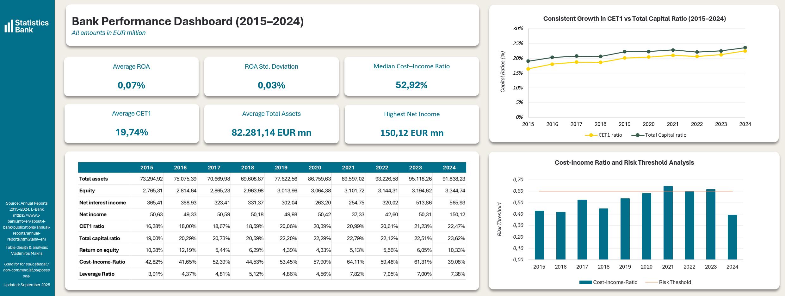
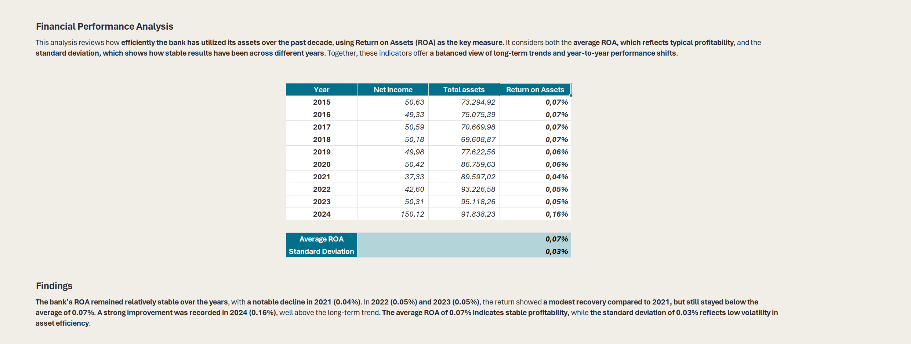
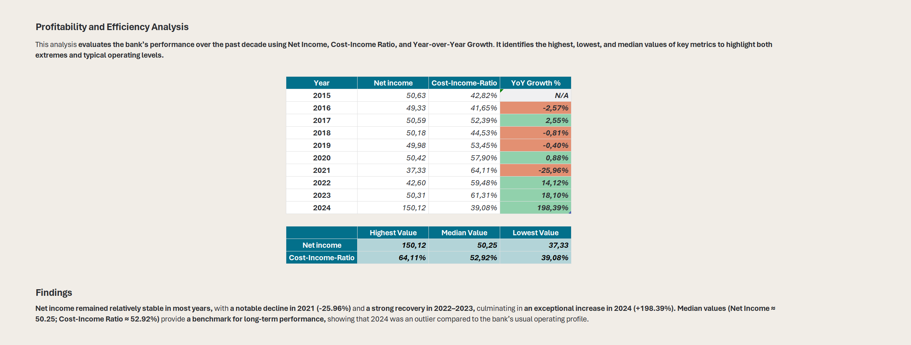
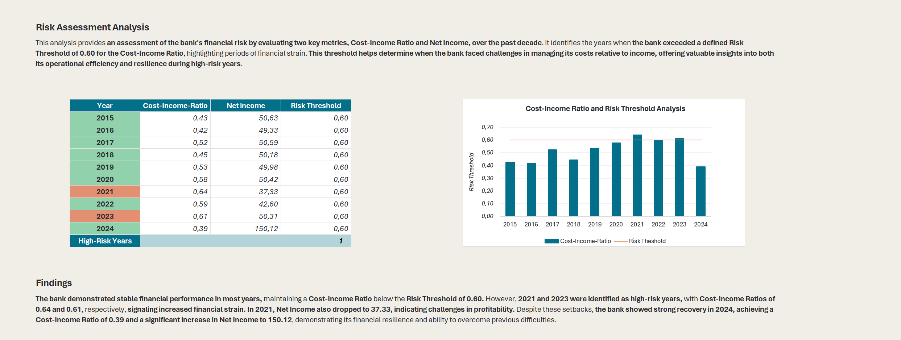
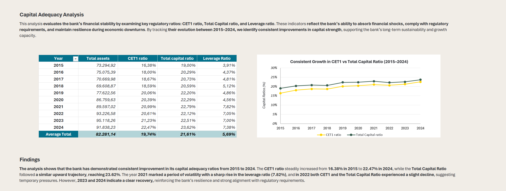
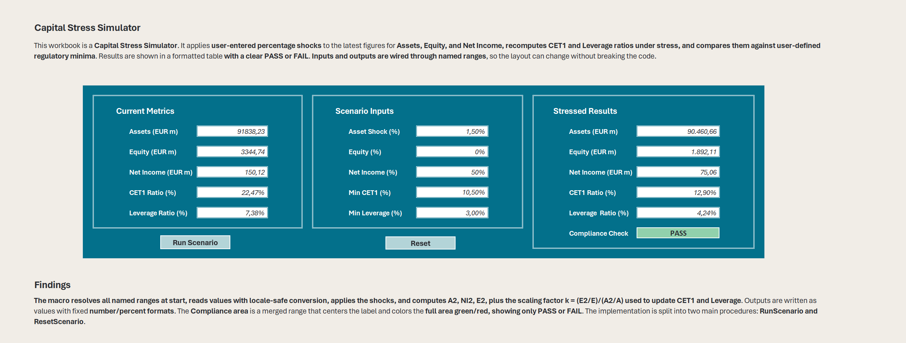

# State Development Bank Analytics (2015–2024)

## Project Overview

This project analyzes financial data from the publicly available annual reports of [L-Bank](https://www.l-bank.info/en/about-l-bank/publications/annual-reports/annual-reports.html?lang=en) from 2015 to 2024. The objective is to transform financial statements into a clear and analytical report. The project presents a structured workflow, including data handling, analysis, and the creation of a consolidated dashboard.

## Tools

- **Microsoft Excel**: Main platform for analysis and dashboards  
- **Excel Functions**: For all calculations and data management  
- **VBA**: Used for automation (Shock_Simulator)  

## Repository

- **data_raw**: Original CSV files with raw financial data  
- **data_clean**: Processed Excel dataset (2015–2024)  
- **dashboard**: Main Excel dashboard file with KPIs and interactive charts  
- **reports**: Exported reports in PDF and HTML formats 
- **vba_code**: Macro modules for automation
- **sql**: schema and queries for the dataset
- **visualizations**: Exported charts and tables  
- **screenshots**: Dashboard and report previews  
- **assets**: Branding assets  
- **style**: Notes on formatting, layout, and design  
- **docs**: Documentation and project map    

## Workbook

- **Dashboard_Overview**: Key KPIs and visuals of financial health  

- **Financial_Performance**: ROA analysis with average and volatility  

- **Profitability_Analysis**: Net Income, Cost-Income Ratio, YoY growth  

- **Risk_Assessment**: Cost-Income vs risk threshold, high-risk years  

- **Capital_Adequacy**: CET1, Total Capital, Leverage ratios  

- **Shock_Simulator**: Macro-driven tool to model financial shocks  

## Usage

- **Requirement**: Microsoft Excel  
- **Macros**: Enable for interactive features  
- **File protection**: Files are read-only, marked as final. Sheets and workbook are locked (no password) to protect formatting and formulas.  

## Data Source

Publicly available annual reports from [L-Bank](https://www.l-bank.de).  

## License

[Creative Commons BY-NC-ND 4.0.](LICENSE) Sharing allowed with attribution. No commercial use or derivative works.

## Disclaimer

This project utilizes financial data extracted from the publicly available annual reports of [L-Bank](https://www.l-bank.info/en/about-l-bank/publications/annual-reports/annual-reports.html?lang=en), a German state development bank. All rights to the underlying data remain with L-Bank. The data is provided on an “as-is” basis and is used solely for educational/non-commercial purposes. All analyses, interpretations, and conclusions contained herein are solely those of the author and do not reflect the views of L-Bank. This project is an independent work and is neither affiliated with nor endorsed by L-Bank.
